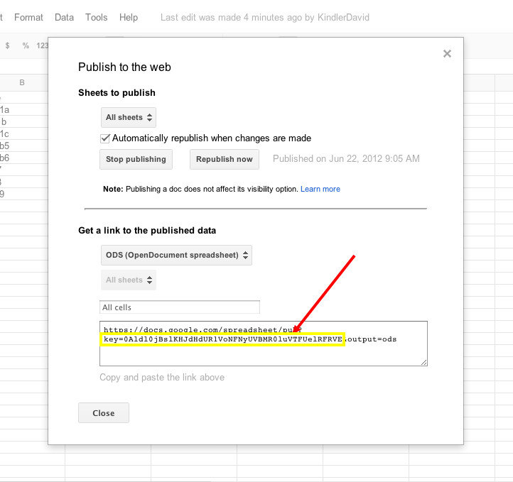

jquery---Google-Spreadsheet
===========================

jquery plugin to manage Google Spreadsheet 

This plugin will retrieve the first sheet of data from a public Google Spreadsheet and display the data in a table format with filters.  
Minimum requirement is the public key of the spreadsheet which you can obtain by going to<em> File -&gt; Publish to the web</em> in the Google Doc.

By default all columns will be displayed. The first row of the table will be used as the header of the table and all columns will be text filtered.

<a href="demo.html">Demo</a>

<h3>Options:</h3>
<ul>
  <li> <strong>key</strong> - Google Spreadsheet ODD key.  Only public spreadsheets can be read. *Required</li>
  <li><strong> GS_Table_class</strong> :  Class applied to table</li>
  <li><strong> table_head</strong> :	Template for table head whcih can include filter definitions.  By default all columns will be shown.  This will redefine how table heads are displayed. Opening and closing thead tags are required. For example: 
  &lt;thead&gt;&lt;tr&gt;&lt;th filter-type=&quot;ddl&quot;&gt;Code&lt;/th&gt;&lt;th &gt;Title&lt;/th&gt;&lt;th filter-type=&quot;ddl&quot;&gt;Description&lt;/th&gt;&lt;/tr&gt;&lt;/thead&gt; 
  <em>ddl </em> denotes &quot;drop down list&quot;. 
  </li>
  <li><strong>table_template</strong> :	Template for table body.  This must be displayed as return function.  You can use the cell[] array to arrange cell data.  For example: 
    function(cell){return '&lt;tr&gt;&lt;td&gt;&lt;a target=&quot;_new&quot; href=&quot;'+cell[2]+'&quot;&gt;'+cell[1]+'&lt;/a&gt;&lt;/td&gt;&lt;td&gt;'+cell[3]+'&lt;/td&gt;&lt;td&gt;'+cell[4]+'&lt;/td&gt;&lt;td&gt;'+cell[5]+'&lt;/td&gt;&lt;/tr&gt;'} 
    <strong>Note:</strong><strong> table_head works in conjunction with table_template.</strong> 
  </li>
  <li><strong>filters</strong>:  default is true for column filtering.  Column filtering can be text or select.  Assign attribute 'filter-type=ddl' for select list in table_head.</li>
  <li><strong>subfitlers</strong> : sets up parent/child relationship for select filters.  eg: {'3':''4'} would make column 4 a subfilter of column 3.</li>
  <li><strong>alternateRowClassNames</strong> :	Alternating class names for each row after filtering. Maximum of two items.</li>
</ul>

<strong>Additional comments:</strong>

A callback function can be assigned in order to perform post processing needs. For example, it can be used to remove a indicator/progress bar.

Classes and elements IDs are assigned which can be used to further style the table. 

.filterColumns : class used for row of filters 
#Col<em>num (eg. #Col1, Col2...): </em> Element ID assigned to each table column. One based index. 
#filterText<em>num</em> (<em>eg. #filterText1, #filterText2...)	</em>: Element ID assigned to each filter. 
.filterText: Class assigned to each filter.

Visit the <a href="demo.html">Demo page</a> which will illustrate the use and provide examples of  features.

&nbsp;
